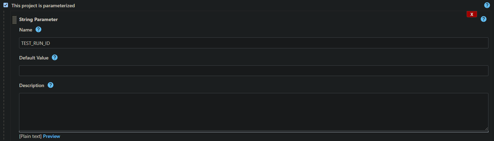
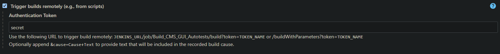
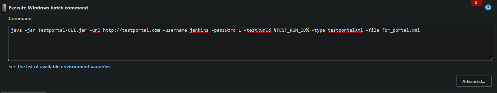
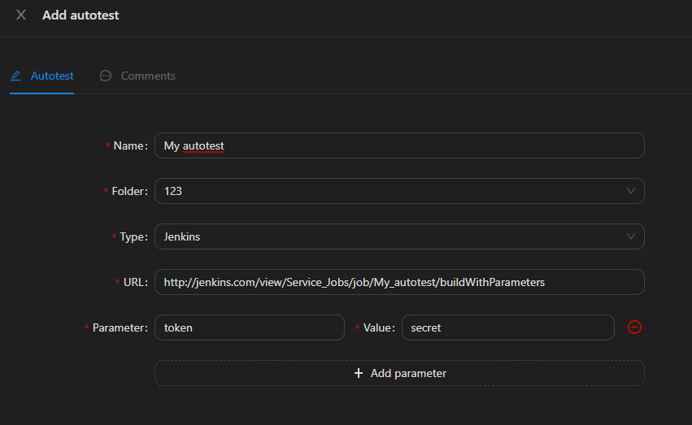
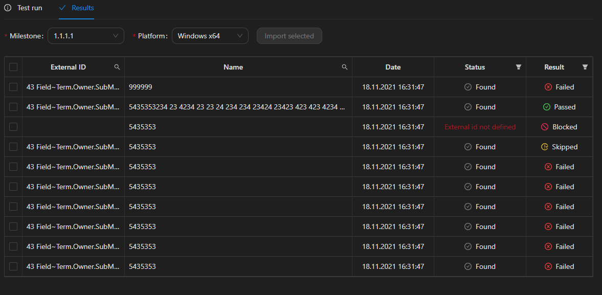
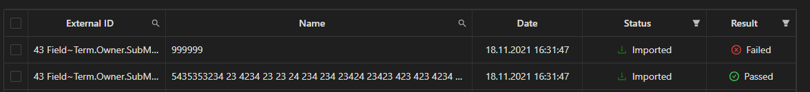

# Пример настройки интеграции с Jenkins

## Настройка сборки в Jenkins

Для запуска сборки в Jenkins удаленно, необходимо настроить несколько параметров:

* Сделать сборку параметризированной и добавить строковый параметр TEST_RUN_ID,
  данный параметр будет передаваться в сборку по умолчанию и необходим для дальнейшей передачи результатов автотеста в
  портал:

* Добавить возможность удаленного запуска сборки и задать токен:
  

* Добавить шаг после выполнения автотеста, который с помощью утилиты Testportal-CLI
  передаст в портал результаты из файла. Описание параметров и пример работы с
  Testportal-CLI можно найти в документации к утилите. Пример шага:

## Создание автотеста в портале

На вкладке `Autotests-Autotests` необходимо добавить автотест:

В поле Type необходимо выбрать Jenkins. 
В поле URL ввести endpoint, на который будет отправлен GET запрос для удаленного запуска
сборки. Для Jenkins этот endpoint будет состоять из URL самой сборки с добавлением
`/buildWithParameters`. 
Также необходимо добавить параметр запроса, с именем token и значением, которое мы
указали на этапе настройки сборки. Параметр `TEST_RUN_ID` является зарезервированным
и добавляется к запросу автоматически.

## Запуск автотеста

Для запуска автотеста необходимо выделить его и нажать кнопку `Run`, в окне параметров
запуска заполнить имя тест-рана, milestone и платформу. 
После запуска на вкладку `Autotests-Test Runs` будет добавлен тест-ран со статусом
`In progress`, а на Jenkins запустится сборка. После завершения автотеста и передачи
результатов в портал статус тест-рана изменится на `Executed`.

## Импорт результатов из тест-рана

Для импорта результатов из тест-рана необходимо открыть его двойным кликом и
перейти на вкладку `Results`.

Поля `Milestone` и `Platform` тест-рана доступны для изменения, до того момента,
пока не импортировано ни одного результата. 
Таблица содержит поля результатов и статус:

* `Found` - кейс найден по `External ID`.
* `New` - кейс не найден, но будет создан.
* `External id not defined` - поле `External ID` не задано.
* `Not found and name null` - кейс не найден и поле `Name` не задано, результат игнорируется.
* `Assigned to other user` - кейс назначен на другого пользователя на выбранном `Milestone` и `Platform`.
* `Imported` - результат загружен и в данный момент является текущим для кейса. 

Для загрузки необходимо выбрать результаты и нажать кнопку `Import selected`, после
чего статус загруженных результатов изменится на `Imported`.

